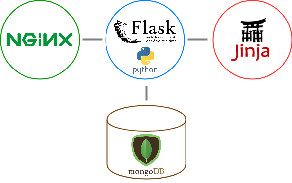

# Cloud-Computing_Project

Repositorio para el desarrollo del proyecto de Cloud Computing, asignatura del Máster Profesional Ingeniería Informática en la [UGR](https://www.ugr.es/).

## [Documentación](https://ramongago.github.io/Cloud-Computing_Project/)

## Descripción del proyecto

Tomando como base el desarrollo del TFG ["Erasmus Management System"](http://www.emsystem.eu/), este proyecto de Cloud Computing busca desarrollar de una manera eficiente un gestor de documentación personal en la nube.

## Solución propuesta

La solución que se propone es el desarrollo de una aplicación que permita mantener los documentos clasificados en un entorno virtual, permitiendo la compartición entre diversos usuarios de una manera sencilla, rápida y eficaz.

## Introducción descriptiva del proyecto

Para desarrollar el proyecto, este constará de los siguientes servicios para almacenar e intercambiar los documentos de los usuarios:

- Almacenamiento en una base de datos `NOSQL` ==> `MongoDB`
- Lenguaje de programación ==> `Python`
- Utilización de un microframework para Python ==> `Flask`
- Motor de plantillas ==> `Jinja2`
- Servidor `HTTP` ==> `Nginx`
- Creación de una `API REST` pública

## Arquitectura

- Arquitectura basada en microservicios.

- Los microservicios serán desplegados en la nube, concretamente en una máquina virtual con [Ubuntu Server 16.04.3 LTS](https://wiki.ubuntu.com/XenialXerus/ReleaseNotes?_ga=2.130289736.659109912.1510849497-1227624830.1510666285), a través de los servicios proporcionados por [Azure](https://azure.microsoft.com/es-es/).

## Provisionamiento

Se ha decidido llevar a cabo el provisionamiento a través de Ansible, un motor de orquestación muy simple que automatiza las tareas de provisionamiento en máquinas virtuales.

En el siguiente enlace se puede acceder a las instrucciones de instalación del mismo:

- [Provisionamiento con Ansible](provision/ansible)

## Automatización de creación de máquinas virtuales

La automatización de la creación de máquinas virtuales se ha realizado a través del cliente de [Azure](https://azure.microsoft.com/es-es/), que ha sido el elegido desde un primer momento para el despliegue de máquinas virtuales en la nube, gracias a su sencillo manejo.

En las máquinas virtuales desplegadas, tanto para realizar las pruebas como para ejecutar el script de automatización, se ha utilizado el SO [Ubuntu Server 16.04.3 LTS](https://wiki.ubuntu.com/XenialXerus/ReleaseNotes?_ga=2.130289736.659109912.1510849497-1227624830.1510666285). Esta decisión viene dada por la familiaridad con este SO  y su amplia comunidad de soporte. Además el hecho de que sea una versión [LTS](https://wiki.ubuntu.com/LTS) (Long Term Support) proporciona un valor añadido a la hora de su elección.

En el siguiente enlace se puede acceder a las instrucciones de la automatización de creación de máquinas virtuales:

- [Automatización](automation/)

Despliegue:52.178.73.193

## Orquestación de máquinas virtuales

La orquestación de la creación de máquinas virtuales se ha realizado a través del cliente de [Azure](https://azure.microsoft.com/es-es/), al igual que en anteriores hitos siguiendo con la línea de despliegue.

Se han creado 2 máquinas virtuales, una destinada al microservicio del servicio web y una segunda para el alojamiento de la base de datos.
La máquina que aloja el servicio web utiliza el sistema operativo [Debian](https://www.debian.org/intro/about), por su gran estabilidad y rendimiento para alojar este tipo de servicios, además de suponer una ligereza y rapidez superior a la hora de desarrollar servicios en él.
Por otro lado para la máquina que soporta la base de datos se ha decidido instalar [CentOS](https://www.centos.org/about/) debido a su elevada rapidez en la consulta y extracción de datos. Esta conclusión se ha extraído un estudio realizado sobre diversas consultas a tablas de datos. Puede consultarse aquí ==> [**Estudio**](http://investigacionit.com.ar/es/el-mejor-linux-para-mysql/).

En el siguiente enlace se puede acceder a las instrucciones de la orquestación de la creación máquinas virtuales:

- [Orquestacion](orquestacion/)

Despliegue Vagrant:40.71.32.51

## Contenedores para despliegue en la nube

Para realizar el despliegue del microservicio propuesto se ha utilizado el servicio proporcionado por [Docker](https://www.docker.com/).
Esta plataforma permite realizar el despliegue de aplicaciones software a través de la creación de contenedores ligeros y portables que pueden ejecutarse en cualquier máquina con Docker instalado, independientemente del sistema operativo que la máquina tenga por debajo, facilitando de esta manera el despliegue.
Tras el estudio de diversas imágenes de sistemas operativo para la creación del contenedor se ha optado por [Atomic Host](http://www.projectatomic.io/download/).
Fedora Atomic Host es un sistema operativo de vanguardia que sigue el modelo del [proyecto Atomic](http://www.projectatomic.io/docs/introduction/). Su diseño está basado en Kubernetes y contenedores y su elección viene dada por las siguientes ventajas:
- Está diseñado específicamente para ejecutar contenedores.
- Posee la certificación y confianza de Red Hat Enterprise Linux.
- Proporciona el despliegue a través de la nube híbrida.
- Permite la orquestación de contenedores.
- Provee de un host seguro por defecto.

A continuación se puede observar la comparativa utilizada para la elección del sistema operativo. En ella se comparan varios sistemas operativos minimalistas para Docker ==> [**Comparativa**](https://www.inovex.de/blog/docker-a-comparison-of-minimalistic-operating-systems/).

En el siguiente enlace se puede acceder a las instrucciones de la creación del contenedor para el despliegue del microservicio:

- [Contenedores](contenedores/)

Contenedor: https://microservicecloudcomputing.azurewebsites.net

Dockerhub: https://hub.docker.com/r/rgcarrera/cloud-computing_project

## Composición de servicios

Para realizar la composición de servicios se ha utilizado el servicio proporcionado por [Docker-compose](https://docs.docker.com/compose/). Se han utilizado dos imágenes para componer el servicio, en primer lugar se ha optado por la imagen oficial de python2.7 (que despliega el servicio web) y en segundo la oficial de MongoDB (para el despliegue del volumen con la base de datos).
La elección viene dada por su simplicidad y ligereza a la hora de desplegar un servicio tan sencillo como el creado. Ambas imágenes proporcionan los servicios mínimos y necesarios para la realización de esta parte del servicio.

Este servicio ofrece una parte del sistema a desarrollar en el caso del proceso erasmus. En este caso se realiza la creación de destinos Erasmus.

Para su despliegue en la nube se ha utilizado una vez más la plataforma de Azure debido a su facilidad y rapidez de despliegue.

En el siguiente enlace se puede acceder a las instrucciones de la creación del contenedor para el despliegue del microservicio:

- [Compose](compose/)

Hito6:http://cloudcomputingrgagoservice.westeurope.cloudapp.azure.com:5000/

## Planificación

- :white_check_mark: Hito 0 => Creación de repositorio en Github y manejo de las herramientas a utilizar.
- :white_check_mark: Hito 1 => Estructuración y descripción del proyecto a llevar a cabo.
- :white_check_mark: Hito 2 => Provisionamiento de máquinas virtuales.
- :white_check_mark: Hito 3 => Automatización de la creación máquinas virtuales.
- :white_check_mark: Hito 4 => Orquestación de máquinas virtuales.
- :white_check_mark: Hito 5 => Uso de contenedores.
- :white_check_mark: Hito 6 => Combinación de infraestructuras virtuales para desplegar una aplicación completa.

## Licencia
Este proyecto será liberado bajo la licencia [GNU GPL V3](https://github.com/RamonGago/Cloud-Computing_Project/blob/master/LICENSE)
